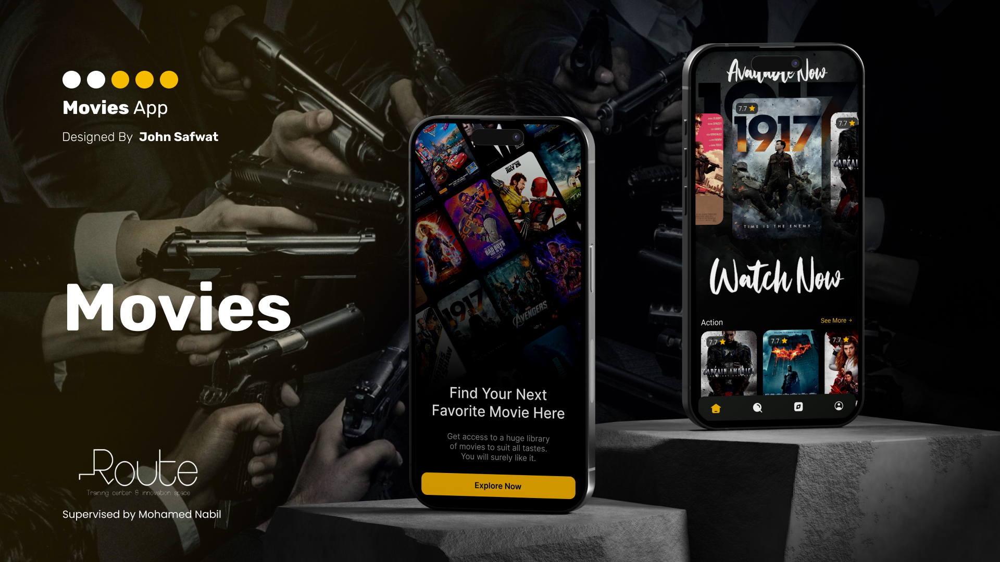

````md
# 🎬 Movies App



<p>
<b>Movies App</b> is a modern Flutter application that allows users to discover, browse, and manage movies with a smooth and interactive experience.  
The app showcases the latest movies in a dynamic slider, provides categorized browsing, search functionality, watchlist management, and user profile features. 🍿✨
</p>

<hr/>

## 🚀 Features

### 🎥 Home Screen
- Display the latest movies in an interactive slider
- Browse multiple movie sections by category
- Smooth scrolling experience with pagination support
- Clean and modern UI design

---

### 🔎 Search
- Search for movies instantly using keywords
- Fast and responsive search experience
- Display movie results with posters and details

---

### 📂 Browse Categories
- Dedicated browse screen with category tabs
- Each category displays its related movies
- Infinite scrolling & pagination support
- Easy navigation between categories

---

### 📄 Movie Details
- View complete movie information
- Movie poster, rating, overview, and release date
- Add or remove movies from the Watch List using bookmarks
- Smooth transition between screens

---

### ❤️ Watch List
- Save favorite movies for later
- Bookmark movies directly from details screen
- Persistent local storage support

---

### 🕒 History
- Automatically save movies viewed by the user
- Display watched/viewed movies in profile screen

---

### 👤 Profile Screen
- Display user information and profile data
- Access Watch List and History sections
- Manage account settings

---

### ⚙️ Account Management
- Edit user information
- Delete account functionality
- Simple and user-friendly settings UI

---

### 🌍 Localization
- Multi-language support
- Save preferences locally

<hr/>

## 📸 Screenshots

<table>
  <tr>
    <td rowspan="2">
      
    </td>
    <td>
      
    </td>
    <td>
      
    </td>
    <td>
      
    </td>
  </tr>

  <tr>
    <td>
      
    </td>
    <td>
      
    </td>
    <td>
      
    </td>
  </tr>

  <tr>
    <td>
      
    </td>
    <td>
      
    </td>
    <td>
      
    </td>
    <td>
      
    </td>
  </tr>

  <tr>
    <td>
      
    </td>
    <td>
      
    </td>
    <td>
      
    </td>
    <td>
      
    </td>
  </tr>

  <tr>
    <td>
      
    </td>
    <td>
      
    </td>
    <td>
      
    </td>
    <td>
      
    </td>
  </tr>

  <tr>
    <td>
      
    </td>
    <td>
      
    </td>
    <td>
      
    </td>
    <td>
      
    </td>
  </tr>

  <tr>
    <td>
      
    </td>
    <td>
      
    </td>
    <td>
      
    </td>
    <td>
      
    </td>
  </tr>

  <tr>
    <td>
      
    </td>
    <td>
      
    </td>
    <td>
      
    </td>
    <td>
      
    </td>
  </tr>

  <tr>
    <td>
      
    </td>
    <td>
      
    </td>
    <td>
      
    </td>
    <td>
      
    </td>
  </tr>
</table>

<hr/>

## 📦 Packages Used

### 🎨 UI & Design
- **flutter_svg** — Display SVG icons and assets.
- **cached_network_image** — Efficient image loading and caching.
- **carousel_slider** — Interactive movie sliders and banners.
- **shimmer** — Beautiful loading placeholders.

---

### 🌍 Localization
- **easy_localization** — Multi-language support.

---

### 🧠 State Management
- **flutter_bloc** — Reactive state management.
- **provider** — Lightweight dependency handling.

---

### 🌐 Networking
- **dio** — Powerful networking and API handling.

---

### 💾 Local Storage
- **shared_preferences** — Store user preferences locally.

---

### 🔥 Backend & Authentication
- **firebase_auth** — User authentication.
- **cloud_firestore** — Store user data, watchlist, and history.

---

### 🧭 Navigation
- **go_router** — Clean and scalable app navigation.

---

### 🌐 Web View
- **webview_flutter** — Open external movie links and trailers.

---

### 🚀 Splash Screen
- **flutter_native_splash** — Customize app launch screen.

<hr/>

## 🛠 Installation & Run

```bash
git clone https://github.com/abdallahelnshar123-ux/movies_v2.git

cd movies_v2

flutter pub get

flutter run
````

<hr/>

## 🧱 Architecture

This project follows the principles of:

* Clean Architecture
* SOLID Principles
* Feature-based Structure
* Repository Pattern

<hr/>

## 👨‍💻 Author & License

### Abdallah Samir Elnshar

This app is part of my Flutter development journey and focuses on building scalable, clean, and production-ready applications. 🚀

Thank you for checking out my work! 🙏

This project is open source and available under the **MIT License**.

```
```
